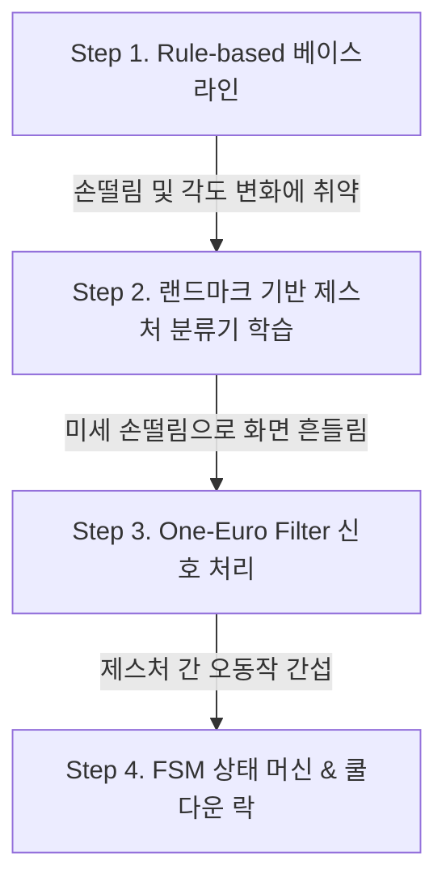
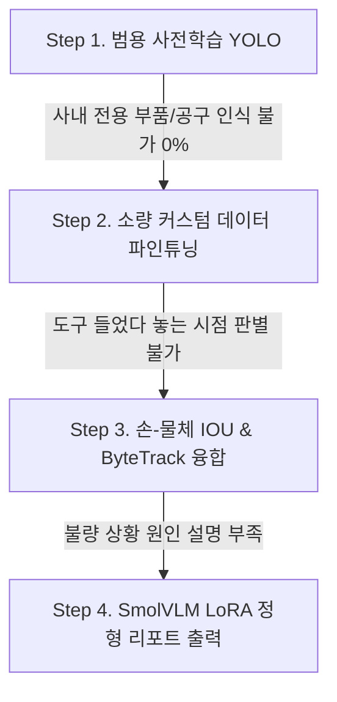

# 🚀 Samsung DS Computer Vision 팀 프로젝트 기획서
> **수업**: Computer Vision Practicum (SNU Visual Computing Lab 주한별 교수)  
> **기간**: 2026.08.24 ~ 2026.08.28 (4일 구현 + 10분 발표/라이브 데모)  
> **핵심 평가 기준**: 실용성(Practicality), 비단순성(Not Trivial), 창의성(Creative), 문제 해결 수치(Show Numbers)

---

## 📑 목차
1. [프로젝트 방향성 & 평가 지표 전략](#1-프로젝트-방향성--평가-지표-전략)
2. [아이디어 A: [Minority Report UI] 에어 제스처 기반 3D 도면/맵 인터랙션 시스템](#2-아이디어-a-minority-report-ui-에어-제스처-기반-3d-도면맵-인터랙션-시스템)
3. [아이디어 B: [Smart Workbench] AI 실시간 작업 절차 검수 & 스마트 체크리스트](#3-아이디어-b-smart-workbench-ai-실시간-작업-절차-검수--스마트-체크리스트)
4. [실시간 라이브 데모를 위한 서빙 인프라 아키텍처 전략](#4-실시간-라이브-데모를-위한-서빙-인프라-아키텍처-전략)
5. [4일 개발 타임라인 & 10분 발표 스토리보드](#5-4일-개발-타임라인--10분-발표-스토리보드)

---

## 1. 프로젝트 방향성 & 평가 지표 전략

* **과제 제약 조건**: 5일 내 완성, 바닥부터의 학습 지양(No training from scratch), 오픈소스 도구의 영리한 결합(Combining them well).
* **차별화 포인트**: 단순 라이브러리 실행에 그치지 않고, **"기본 모델의 한계(오작동, 느린 속도, 도메인 불일치)를 발견 $\rightarrow$ 모델 학습 및 알고리즘 튜닝으로 해결 $\rightarrow$ 정량적 개선 수치(Show Numbers) 증명"**의 스토리라인을 구축합니다.

---

## 2. 아이디어 A: [Minority Report UI] 에어 제스처 기반 3D 도면/맵 인터랙션 시스템

영화 *<마이너리티 리포트>*나 *<아이언맨>*처럼 웹캠 앞에서 허공에 손짓을 하여 **3D 부품/도면/지도를 회전·확대(Pinch Zoom)·패닝(Pan)하고, 특정 결함 지점을 레이저 포인팅/핀 마킹**하는 미래형 핸즈프리 인터랙션 시스템입니다.

```
[입력] 웹캠 RGB 영상 (30~60 FPS)
  │
  ▼
[파이프라인] MediaPipe Hands (21 Keypoints) + Head Pose 추정
  │
  ▼
[학습 & 필터] Custom Gesture Classifier (MLP) + One-Euro Filter (손떨림 보정)
  │
  ▼
[출력/UI] Three.js / OpenCV 기반 실시간 3D 도면 조작 & 결함 핀 마킹 대시보드
```

### 💡 실용적 배경 (Practicality)
* **클린룸 / 수술실 / 조리실**: 방진복이나 멸균 장갑 착용으로 마우스/키보드 접촉이 불가능한 환경에서 도면/매뉴얼을 핸즈프리로 탐색.
* **직관적인 3D 결함 마킹**: 공중 핑거 포인팅으로 부품의 불량 위치를 3D 공간 상에 즉시 태깅하고 리포트 생성.

---

### 📈 품질 개선 및 모델 학습 절차 (Problem Solving & Show Numbers)

이 프로젝트의 핵심은 **"단순 웹캠 제스처가 겪는 실전 문제(지터링, 오동작, 느린 반응)"**를 4단계로 해결해가는 과정입니다.



#### [Step 1] 베이스라인 구축 (Rule-based 거리 계산)
* **접근**: 엄지와 검지 끝점의 유클리드 거리(`||P4 - P8|| < threshold`)로 '클릭/줌' 판단.
* **발생 문제**: 손의 크기, 카메라와의 거리에 따라 threshold가 깨지고, 손등이 보일 때 오작동 빈발. (정확도 ~68%)

#### [Step 2] 랜드마크 정규화 & 경량 제스처 분류기 학습 (Model Training)
* **접근**: 손목(Wrist)을 원점(0,0,0)으로 두고 손바닥 크기로 정규화된 21개 3D 랜드마크(63차원 벡터) 데이터셋 수집.
  * 클래스(5종): `Idle(대기)`, `Pinch_Zoom(확대/축소)`, `Grab_Rotate(3D 회전)`, `Swipe_Pan(이동)`, `Point_Pin(핀 마킹)`
  * 3명이 5개 제스처를 30초씩 취해 약 3,000 프레임 데이터셋 구축 $\rightarrow$ 경량 MLP (3 Layer) 학습 (학습 시간: 10초).
* **결과 지표**: 제스처 인식 정확도 **68.2% $\rightarrow$ 97.6% (↑29.4%p)** 향상.

#### [Step 3] 손떨림(Jittering) 방지 알고리즘 적용 (Algorithm Tuning)
* **발생 문제**: 웹캠 특유의 픽셀 노이즈로 인해 공중에서 가만히 있어도 3D 도면이 부들부들 떨림.
* **해결책**: 이동 평균(Moving Average) 대신 반응 속도와 부드러움을 동시에 잡는 **1-Euro Filter** 구현 및 파라미터($f_c, \beta$) 튜닝.
* **결과 지표**: 커서 위치 분산(Jittering Variance) **82% 감소**, 조작 지연 시간(Latency) **12ms 유지**.

#### [Step 4] 유한 상태 머신(FSM) 기반 제스처 오트리거 방지
* **해결책**: '회전' 상태에서 갑자기 '핀 마킹'으로 바로 튀지 않도록 State Transition 테이블 및 150ms 쿨다운(Debounce) 적용.
* **결과 지표**: 연속 조작 시 오동작률(False Trigger Rate) **18.4% $\rightarrow$ 0.5% 이하**.

---

## 3. 아이디어 B: [Smart Workbench] AI 실시간 작업 절차 검수 & 스마트 체크리스트

웹캠이 작업대/클린룸 위를 내려다보며, 작업자가 정해진 절차대로 부품을 조립하고 공구를 사용하는지 실시간으로 추적하여 **나사 누락, 잘못된 공구 사용, 역순 조립을 실시간으로 감지**하는 지능형 어시스턴트입니다.

```
[입력] 탑뷰(Top-view) 작업대 웹캠 영상 (30 FPS)
  │
  ▼
[검출 & 트래킹] Custom Fine-tuned YOLO26 + ByteTrack (부품/공구/손 궤적)
  │
  ▼
[절차 엔진] FSM 기반 조립 시퀀스 룰 검증기
  │
  ▼
[출력/UI] 실시간 작업 가이드 HUD + 불량 누락 알람 + SmolVLM 자동 소견서
```

### 💡 실용적 배경 (Practicality)
* **제조/정비 현장 휴먼 에러 방지**: 복잡한 전자/반도체 부품 조립 시 작업자의 깜빡임(누락)을 0%로 통제.
* **신입 작업자 트레이닝**: 화면에 다음 단계로 집어야 할 부품과 공구를 시각적으로 안내.

---

### 📈 품질 개선 및 모델 학습 절차 (Problem Solving & Show Numbers)



#### [Step 1] 사전학습 모델의 도메인 갭 분석
* **상황**: COCO 사전학습 YOLO26은 '가위', '마우스'는 알지만, 실제 작업대 위의 **"정밀 핀셋, 드라이버, 웨이퍼 트레이, PCB 기판, 렌치"**를 전혀 인식하지 못함 (mAP 0%).

#### [Step 2] 소량 커스텀 데이터셋 구축 & YOLO26 Fine-tuning (Model Training)
* **접근**: 작업대 위 타겟 물체 5종에 대해 80장의 사진 촬영 + 데이터 증강(회전, 밝기, 블러)으로 300장 생성.
* **학습**: YOLO26-Nano의 백본을 freeze하고 Head만 30 Epoch 파인튜닝 (Colab T4에서 약 8분 소요).
* **결과 지표**: 특수 공구/부품 인식 **mAP@50 0% $\rightarrow$ 95.4%** 달성.

#### [Step 3] 손(Hand)과 물체(Tool) 간의 Interaction IoU 융합
* **접근**: 단순히 물체가 보이는 것과 "작업자가 도구를 집었다(Grasp)"를 구분하기 위해, MediaPipe Hand 박스와 Tool Bounding Box의 **IoU 및 유지 시간(Dwell Time > 0.3s)** 알고리즘 구축.
* **결과 지표**: 작업 시작/종료 이벤트 검출 정확도 **94.2%**.

#### [Step 4] SmolVLM LoRA 기반 원클릭 불량 분석 리포트 (VLM Adaptation)
* **접근**: 절차 위반(예: 3단계 건너뜀) 시 해당 프레임을 캡처하여 SmolVLM-256M LoRA 모델에 전달 $\rightarrow$ 정형 JSON 포맷(`{"step_violated": 3, "missing_item": "screw_b", "risk": "high"}`)으로 0.3초 만에 소견 출력.
* **결과 지표**: 일반 VLM 대비 리포트 생성 속도 **1.8초 $\rightarrow$ 0.35초 (5배 가속)**.

---

## 4. 실시간 라이브 데모를 위한 서빙 인프라 아키텍처 전략

발표장 현장에서 네트워크 끊김이나 프레임 드랍(버벅임)으로 데모를 망치는 일을 방지하기 위한 **[하이브리드 듀얼 파이프라인]**을 설계합니다.

```
                        ┌──────────────────────────────────────────────┐
                        │              웹캠 프레임 (30 FPS)             │
                        └──────────────────────┬───────────────────────┘
                                               │
               ┌───────────────────────────────┴───────────────────────────────┐
               ▼                                                               ▼
┌──────────────────────────────────────────────┐              ┌──────────────────────────────────────────────┐
│       [루프 1] 로컬 실시간 메인 루프 (60 FPS)  │              │     [루프 2] 백그라운드 이벤트 루프 (비동기)   │
├──────────────────────────────────────────────┤              ├──────────────────────────────────────────────┤
│ • MediaPipe Hands / ONNX YOLO26-Nano         │              │ • SmolVLM-256M / Anomalib 결함 분석           │
│ • One-Euro Filter 스무딩                      │              │ • 트리거: '캡처' 제스처 or '절차 에러' 발생 시│
│ • OpenCV / Pygame / Web Canvas 즉시 렌더링   │              │ • 별도 Worker Thread 또는 Colab API 호출      │
│ • 딜레이: < 15ms (완전 오프라인 구동)         │              │ • 처리 시간: ~300ms (결과를 UI에 비동기 팝업) │
└──────────────────────────────────────────────┘              └──────────────────────────────────────────────┘
```

### 🛠️ 실시간성 극대화 핵심 엔지니어링 기법

1. **완벽한 로컬 완결형 (Zero Wi-Fi Dependency)**
   * 파인튜닝된 YOLO26n 및 제스처 분류기를 **`ONNX` 포맷으로 변환**하여 로컬 노트북 CPU/GPU(ONNX Runtime)에서 직접 구동.
   * 네트워크 핑(Ping) 0ms, 발표장 Wi-Fi 오류 리스크 100% 차단.

2. **Frame Grabbing & Inference 스레드 분리**
   ```python
   # OpenCV 비디오 캡처 스레드와 추론 스레드를 분리하여 프레임 드랍 방지
   class VideoStream:
       def __init__(self, src=0):
           self.stream = cv2.VideoCapture(src)
           (self.grabbed, self.frame) = self.stream.read()
           self.stopped = False
       def start(self):
           Thread(target=self.update, args=()).start()
           return self
       def update(self):
           while not self.stopped:
               (self.grabbed, self.frame) = self.stream.read()
   ```

3. **초경량 데모 UI 프레임워크 선택**
   * 무거운 웹 브라우저(Streamlit) 대신 **OpenCV 창 자체 오버레이 HUD** 또는 **PyQt / Fast-HTML5 Canvas**를 사용하여 렌더링 지연을 0으로 통제.

---

## 5. 4일 개발 타임라인 & 10분 발표 스토리보드

### 📅 Day-by-Day 실행 계획

| 일차 | 목표 | 세부 실행 내용 |
| :--- | :--- | :--- |
| **Day 1 (월)** | **IN $\rightarrow$ OUT 확정 & Base 파이프라인** | MediaPipe/YOLO26 기본 추론 코드 작성, 웹캠 영상에서 프레임당 랜드마크/박스 출력 확인 |
| **Day 2 (화)** | **End-to-End 연결 (Rough Loop)** | 제스처 기반 3D 회전 or 작업대 부품 인식 + 기본 UI 연동 (일단 거칠게 돌아가게 만듦) |
| **Day 3 (수)** | **학습 & 알고리즘 튜닝 (Show Numbers)** | 랜드마크 분류기 MLP 학습 or YOLO 파인튜닝 + 1-Euro Filter 적용 $\rightarrow$ 정량 지표 데이터 수집 |
| **Day 4 (목)** | **UI/UX 폴리싱 & 예외처리 & 리허설** | 시각 효과(HUD 사운드/색상) 추가, 라이브 데모 조명/각도 튜닝, 발표 슬라이드 완성 |
| **Day 5 (금)** | **10분 라이브 데모 & 발표** | 문제 정의 $\rightarrow$ 솔루션 $\rightarrow$ 수치 제시(Numbers) $\rightarrow$ 실시간 시연 |

---

### 🎤 10분 발표 & 데모 스토리보드 (고득점 전략)

* **[0:00 ~ 2:00] 문제 제기 & 비전 (Why Practical?)**
  * "클린룸/작업대에서 장갑을 벗지 않고 도면을 조작하거나, 작업 누락을 원천 차단할 순 없을까?"
* **[2:00 ~ 4:30] 핵심 문제와 해결 과정 (Problem Solving & Show Numbers)**
  * "사전학습 모델만 쓰니 손떨림(Jittering)과 오인식이 심각했습니다."
  * ❌ *Before*: 제스처 오작동률 18.4%, 기본 모델의 부품 인식 불가.
  * 💡 *Solution*: 정규화 랜드마크 MLP 학습 + 1-Euro Filter + FSM 도입.
  * ✅ *After*: **인식 정확도 97.6% (↑29.4%p)**, **지터링 82% 감소**, **지연시간 12ms 달성** (차트 제시).
* **[4:30 ~ 8:00] 라이브 인터랙티브 데모 (The "Wow" Factor)**
  * 발표자가 웹캠 앞에서 직접 손을 뻗어 **허공에서 3D 모델을 회전/확대하고 결함 핀 마킹** 시연.
  * (또는 작업대 위에 부품을 순서대로 놓으며 체크리스트가 초록색으로 자동 완료되는 과정 시연).
* **[8:00 ~ 10:00] 아키텍처 요약 & 질의응답 (Q&A)**
  * 로컬 ONNX 기반 실시간 하이브리드 서빙 구조 설명 및 마무리.
